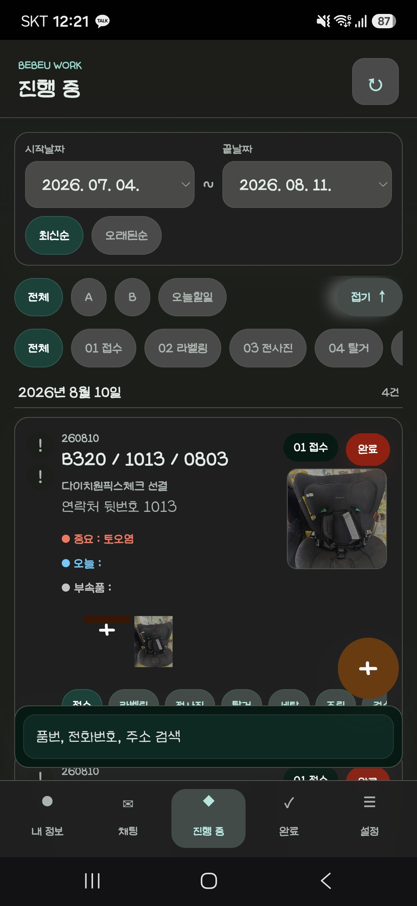
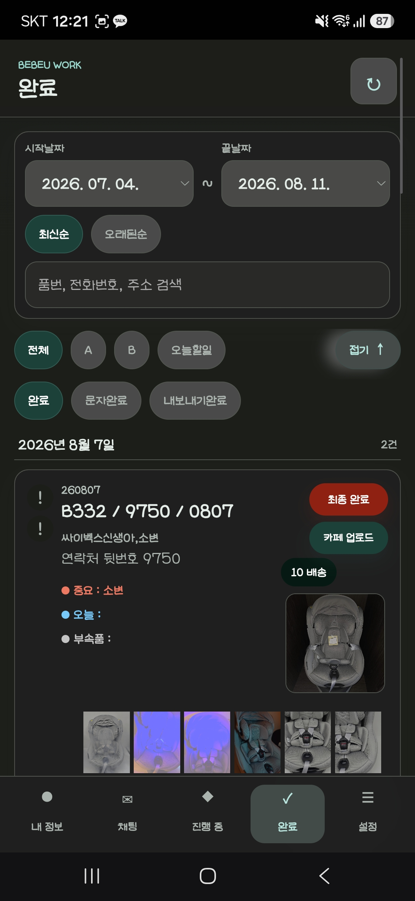
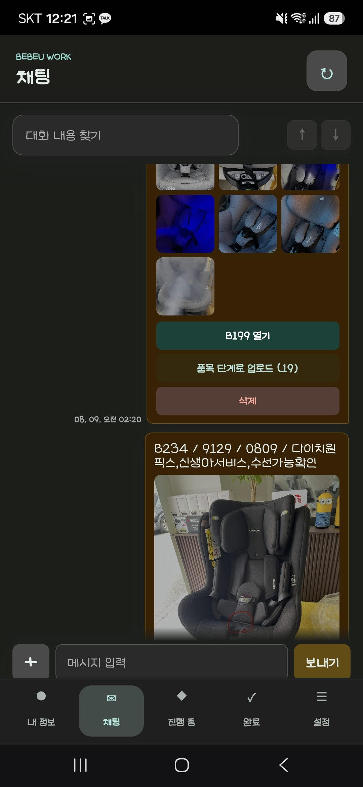

# BEBEU Work PWA

유모차, 카시트, 아기용품 세탁 작업을 현장에서 바로 관리하기 위해 만든 모바일 중심 PWA입니다.

접수부터 단계별 사진 업로드, 진행 상태 관리, 완료 후 고객 링크 전송, 네이버 카페 업로드, 직원 근태 정산까지 실제 매장 운영 흐름에 맞춰 구성했습니다.

## 화면 예시

### 진행 중 목록

진행 중인 품목을 날짜별로 확인하고, 접수부터 배송까지 단계 상태를 바로 변경할 수 있습니다.  
중요 메모, 오늘 할 일, 부속품 메모를 카드 안에서 함께 확인해 작업자가 사진을 보며 체크할 수 있도록 구성했습니다.



### 완료 목록

완료된 품목은 완료, 문자완료, 내보내기완료 상태로 관리합니다.  
배송전, 링크전송, 배송완료 또는 픽업전, 링크전송 버튼을 통해 고객 공유 흐름을 빠르게 처리할 수 있습니다.



### 채팅 및 사진 공유

채팅방에서는 작업자들이 사진과 메시지를 공유할 수 있고, 업로드된 사진을 품목 단계로 바로 등록할 수 있습니다.  
현장 사진을 카카오톡처럼 시간순으로 확인하면서 필요한 품목으로 연결하는 흐름을 지원합니다.



## 주요 기능

- A/B 접수 형식 자동 파싱
- 접수, 라벨링, 전사진, 탈거, 세탁, 조립, 검수, 후사진, 살균, 배송 단계 관리
- 단계별 사진 업로드 및 최근 사진 미리보기
- 중요, 오늘 할 일, 부속품 메모 관리
- 긴급 항목 및 오늘 할 일 필터
- 채팅 기반 사진 공유와 품목 단계 업로드
- 고객 공유 URL 생성 및 문자/링크 전송 상태 관리
- 완료 품목의 네이버 카페 업로드 자동화
- 관리자/직원 로그인 및 비밀번호 변경
- 직원 근태 기록과 관리자 정산 화면
- 사진 휴지통 및 복구 기능
- PWA 설치와 모바일 화면 최적화

## 기술 스택

- Frontend: Vanilla JavaScript, HTML, CSS, PWA Service Worker
- Backend: Node.js HTTP server
- Database: MariaDB / MySQL
- Media: Sharp image processing
- Automation: Playwright
- Push: Web Push / VAPID
- Deployment: Cloudflare Tunnel

## 폴더 구조

```text
C:\bebeyu
├─ bebeu
│  ├─ v1                 # 이전 버전 보관
│  └─ v2                 # 현재 운영 버전
│     ├─ src/app         # 기능별 frontend source
│     ├─ public          # PWA frontend output
│     ├─ database        # schema/migration SQL
│     ├─ scripts         # build/maintenance scripts
│     ├─ server.js       # Node.js backend
│     └─ package.json
├─ database              # root-level database scripts
├─ docs/images           # README 화면 예시 이미지
├─ .env.example          # 공개 가능한 환경 변수 샘플
└─ .gitignore
```

## 실행 방법

```powershell
cd C:\bebeyu\bebeu\v2
npm install
copy .env.example .env
npm start
```

실행 후 접속 주소:

```text
http://localhost:3000
```

Frontend source는 `bebeu/v2/src/app`에 기능별로 분리되어 있습니다.  
수정 후 아래 명령으로 `bebeu/v2/public/app.js`를 생성합니다.

```powershell
npm run build:app
```

Cloudflare Tunnel을 사용하는 운영 환경에서는 서버 실행 후 별도 터널을 실행합니다.

```powershell
cloudflared tunnel run
```

## 환경 변수

실제 운영 값은 `.env` 또는 서버 환경 변수로 관리합니다.  
저장소에는 `.env.example`만 포함합니다.

필수 항목:

- `MYSQL_HOST`
- `MYSQL_PORT`
- `MYSQL_USER`
- `MYSQL_PASSWORD`
- `MYSQL_DATABASE`
- `PHOTO_ROOT`
- `DEFAULT_ADMIN_PASSWORD`

선택 항목:

- `NAVER_CLIENT_ID`
- `NAVER_CLIENT_SECRET`
- `NAVER_CAFE_CLUB_ID`
- `NAVER_CAFE_MENU_ID`
- `APP_ALLOWED_ORIGINS`
- `UPLOAD_LIMIT_MB`

## 보안 및 공개 제외 대상

다음 항목은 저장소에 포함하지 않습니다.

- `.env`, 실제 DB 비밀번호
- `push-vapid.json`
- 사진 저장소 `bebeu_image/`
- 로그 `app_logs/`, `logs/`
- 네이버 로그인 브라우저 프로필 `naver-cafe-browser/`
- `node_modules/`
- zip, dump, backup 파일

## 프로젝트 메모

이 프로젝트는 단순 CRUD가 아니라 실제 세탁 매장의 반복 업무를 줄이기 위해 만든 현장 운영 도구입니다.  
모바일에서 빠르게 사진을 등록하고, 작업 단계와 고객 공유 상태를 끊기지 않게 관리하는 데 초점을 맞췄습니다.
